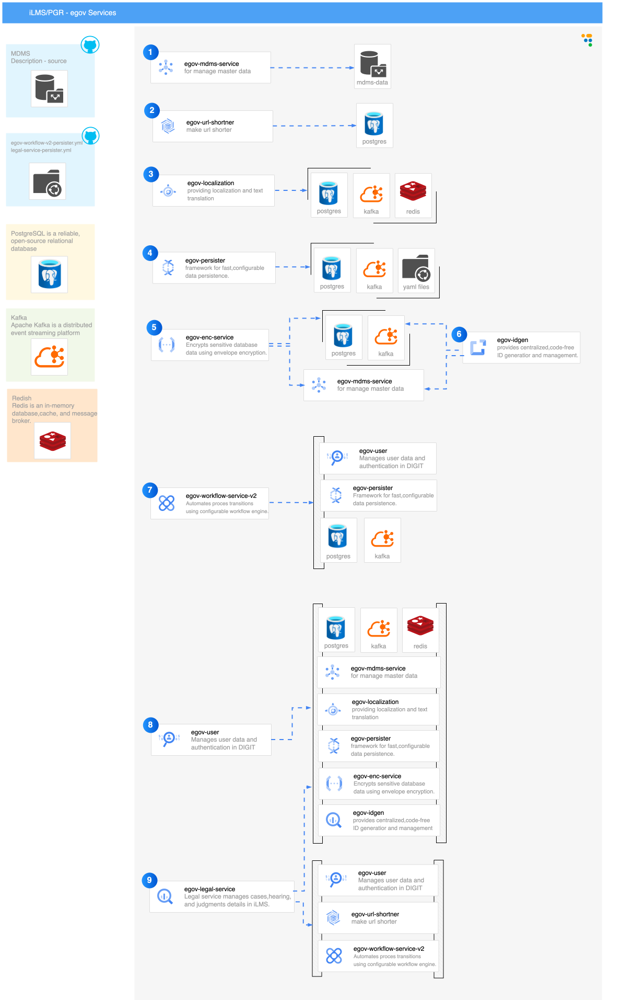

# DIGIT Urban Stack 

DIGIT is a set of Open APIs, services, and reference implementations, setup as a public good, to allow government entities, businesses, startups, and civil society to use a unique digital Infrastructure and build solutions for urban India at a large scale. It provides a set of open standards, specifications and documentation to create a level playing field and enable ecosystem players to innovate on the stack. As a public good, the platform is provided without profit or restriction to all members of society.

DIGIT focuses on inclusion and is designed on the principle of enhancing both platform openness and choice for citizens. The platform uses open APIs and standards, creating a powerful framework to drive convergence across the multiple systems currently in use, and to lower the barrier to entry for locally-developed solutions. Keeping in mind that most Indians use the internet through their phones, we follow and advocate a “mobile-first” approach, while supporting multi-channel access to accommodate diverse needs and preferences.

## Explore more from these Useful Links:

* ### [Documentation](https://docs.digit.org)


## Tech Overview


##


# eGov (iLMS)  – Documentation (With Service Descriptions)

## 📘 Overview
The **Integrated Legal Management System (iLMS)** is a DIGIT-based application designed to manage:
- Legal case creation  
- Hearings & judgments  
- Advocate & party management  
- Workflow-driven approvals  
- Master data-driven configuration  

This documentation includes:
- Full architecture diagram  
- Short description of every DIGIT microservice  
- Platform prerequisites  
- Execution sequence  
- Links to individual service README files  

---

## 🖼️ System Architecture Diagram


---

# 🏗️ Platform Prerequisites

### **PostgreSQL**
Stores data for all services including users, cases, workflow states, and master data.

### **Kafka**
Messaging layer for event-driven data persistence and workflow triggers.

### **Redis**
Provides caching, session storage, and optimization for high-speed access.

### **DIGIT Platform Tools**
Core foundation microservices required to run iLMS:
- MDMS  
- Workflow  
- User  
- Persister  
- Localization  
- IDGEN  
- Encryption  
- URL Shortening  

---

# 📦 Microservices With Short Descriptions

Below is a short description of each service in iLMS.

---

## **1️⃣ egov-mdms-service**
**Purpose:**  
Provides master data like judges, case types, departments, case categories, gender types, etc.

**Used For:**  
Dropdowns, rules, workflow configuration.

🔗 README: [egov-mdms-service](./core-services/egov-mdms-service/README.md)


---

## **2️⃣ egov-url-shortener**
**Purpose:**  
Creates short URLs used in SMS/email notifications for easy case tracking.

🔗 README: [egov-url-shortener](./core-services/egov-url-shortening/README.md)


---

## **3️⃣ egov-localization**
**Purpose:**  
Handles label translation into multiple languages (English, Hindi).  

**Used For:**  
UI text, messages, notifications.

🔗 README: [egov-localization](./core-services/egov-localization/README.md)


---

## **4️⃣ egov-persister**
**Purpose:**  
Consumes Kafka events and persists legal cases, hearing records, judgments, and documents to PostgreSQL using YAML configuration.

🔗 README: [egov-persister](./core-services/egov-persister/README.md)


---

## **5️⃣ egov-enc-service**
**Purpose:**  
Encrypts and decrypts sensitive personal/legal data and ensures security compliance.

🔗 README: [egov-enc-service](./core-services/egov-enc-service/README.md)

---

## **6️⃣ egov-idgen**
**Purpose:**  
Generates unique sequential IDs for:
- Legal Cases  
- Hearings  
- Documents  
- Judgments  

Example Format:  
`CASE-[cy:yyyy-MM-dd]-[SEQ_EG_PT_PTID]`

🔗 README: [egov-idgen](./core-services/egov-idgen/README.md)

---

## **7️⃣ egov-workflow-service-v2**
**Purpose:**  
Manages workflow lifecycle for:
- Case review  
- Approval  
- Hearing processing  
- Judgment closure  

Uses MDMS-configured BusinessService JSON.

🔗 README: [egov-workflow-service-v2](./core-services/egov-workflow-service-v2/README.md)

---

## **8️⃣ egov-user**
**Purpose:**  
Handles authentication and role-based access control for:
- Data Entry Operators  
- Legal Clerks  
- Reviewing Officers  
- Admins  

Stores user profile, roles, and tenant-level access.

🔗 README: [egov-user](./core-services/egov-user/README.md)

---

## **9️⃣ egov-legal-service**
**Purpose:**  
Core microservice responsible for:
- Creating legal cases  
- Adding hearing details  
- Storing judgments  
- Linking advocates & parties  
- Triggering workflow transitions  
- Publishing persistence events to Kafka  

🔗 README: [egov-legal-service](./municipal-services/legal-services/README.md)

---

# 📤 Execution Sequence Flow (End-to-End)

1. User logs in → **egov-user**  
2. Master data is loaded → **egov-mdms**  
3. Case creation request sent → **egov-legal-service**  
4. Case ID generated → **egov-idgen**  
5. Workflow initialized → **egov-workflow-service**  
6. Case persisted via Kafka → **egov-persister**  
7. URL shortener triggered for notifications → **egov-url-shortener**  
8. Labels translated → **egov-localization**  
9. Data cached → **Redis**  

---

# 🐳 Docker Deployment Summary

```bash
docker build -t ilms-legal:v1 .
docker run -d --env-file /opt/egov/.env -p 9098:9098 ilms-legal:v1
```

---

# 📁 Project Folder Structure

```
iLMS_backend/
│
├── core-services/
│   ├── egov-mdms-service/
│   ├── egov-url-shortener/
│   ├── egov-localization/
│   ├── egov-persister/
│   ├── egov-enc-service/
│   ├── egov-idgen/
│   └── egov-user/
│
├── municipal-services/
│   └── legal-services/
│
├── workflow/
│   └── egov-workflow-service-v2/
│
└── gateway/
    └── zuul/
```

---

# 👥 Maintainers

- **TechforGov Platform Team**

---

# 📜 License
### DIGIT Code is open sources under the MIT License and under [Contributor License Agreement](https://forms.gle/nnNZjB7P1YPuEHb69)

### DIGIT is Developed and Maintained by eGovrnments Foundation (A non-profit and non-governmental organisation)

